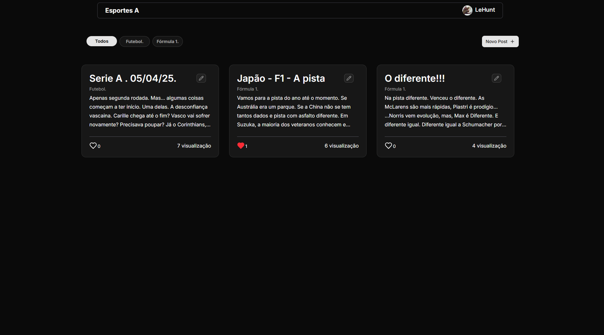
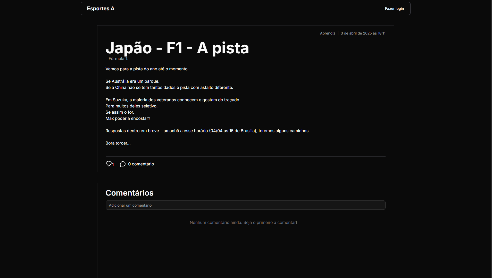
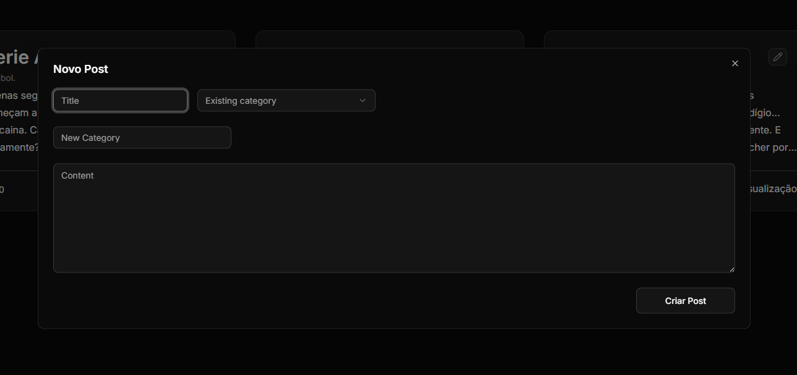
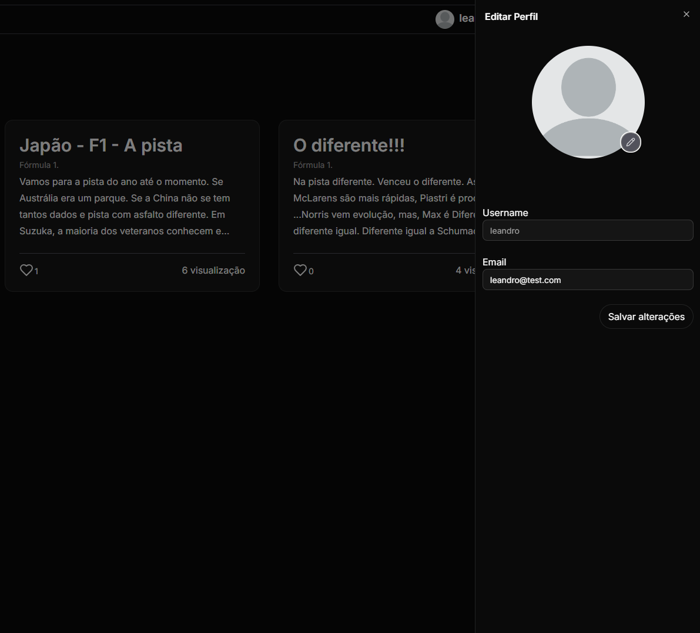
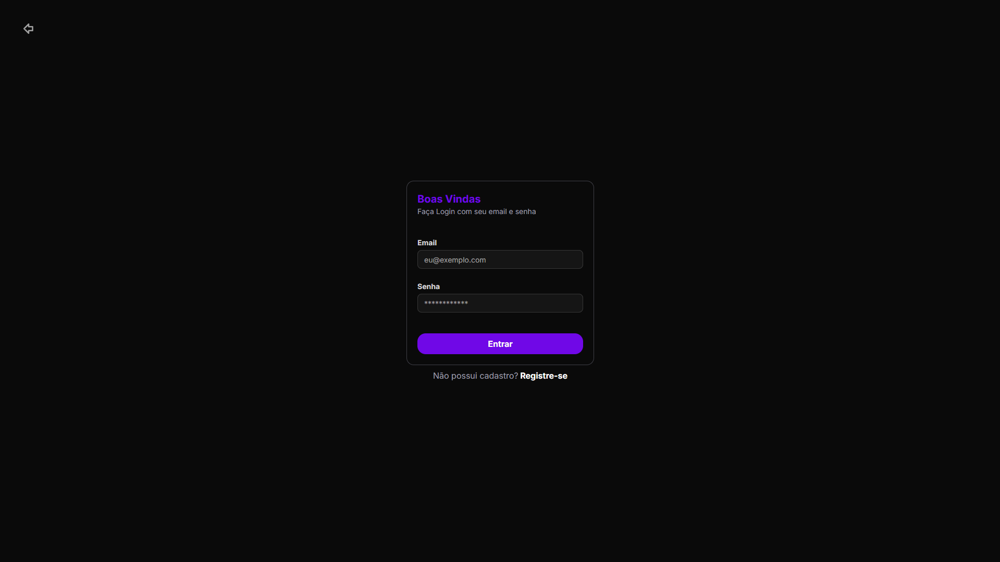
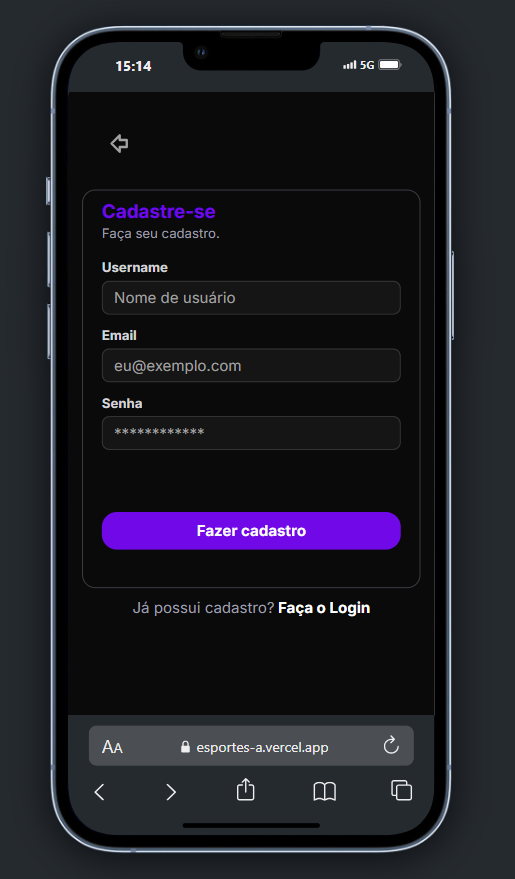
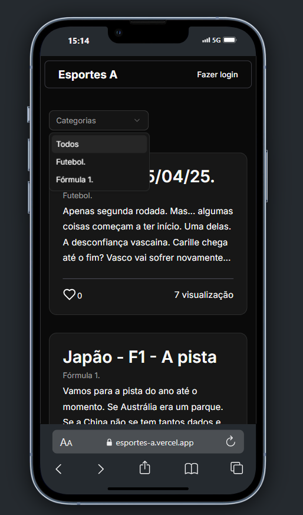

<h1 align="center">⚽ Esportes A - Blog</h1>

<p align="center">
Um blog moderno focado em esportes, feito com Next.js, Prisma e PostgreSQL.
</p>

---

## 📜 Descrição do Projeto

Este projeto é um Blog criado para atender a uma necessidade real: oferecer a uma pessoa um espaço próprio para compartilhar ideias, experiências e construir sua rede. Enquanto o administrador tem controle para criar os posts, os demais usuários podem interagir curtindo e comentando.

---

## 🚀 Tecnologias Utilizadas

### Frameworks, Bibliotecas e Ferramentas

- **Next.js** (App Router + Server Actions)
- **React 19**
- **TypeScript 5**
- **ESLint** (padronização e boas práticas)
- **TailwindCSS**
- **Shadcn/ui**
- **lucide-react**
- **Prisma ORM**
- **PostgreSQL**
- **Supabase Storage** (upload de imagens)
- **JWT (autenticação)** com **jose**
- **bcryptjs** (hash de senha)
- **react-hook-form**
- **Zod** (validação de dados)

---

## 📦 Funcionalidades

- Autenticação com JWT
- Sessões persistentes e seguras via cookies
- Criação e edição de posts (ADMIN)
- Curtir e comentar posts (usuários logados)
- Atualização de perfil e avatar
- Upload de imagens com Supabase
- Sistema de categorias
- Controle de permissões (`ADMIN` | `NORMAL`)
- Revalidação de dados em tempo real com Server Actions

---

## 🧠 Backend

### 📌 Models Principais

#### 👤 User

```json
{
  "id": "uuid",
  "userName": "admin_user",
  "email": "admin@example.com",
  "role": "ADMIN",
  "picture": "https://example.com/avatar.jpg",
  "createdAt": "2023-11-01T12:00:00.000Z",
  "updatedAt": "2023-11-01T12:00:00.000Z",
  "likedPostCount": 5,
  "Comments": [],
  "Posts": [],
  "Likes": []
}
```

#### 📝 Post

```json
{
  "id": "uuid",
  "title": "Introdução ao Prisma ORM",
  "content": "...",
  "userId": "uuid",
  "viewCount": 150,
  "likeCount": 25,
  "createdAt": "2023-11-01T12:00:00.000Z",
  "updatedAt": "2023-11-01T12:00:00.000Z"
}
```

#### 🎭 Role (Enum)

```json
"ADMIN" | "NORMAL"
```

---

## 🔐 Autenticação JWT

A autenticação da aplicação é baseada em tokens JWT. Ao realizar o login, o servidor cria uma sessão criptografada armazenada em um cookie `HTTP-only` e `secure`, garantindo maior segurança e proteção.

### Principais funções (session.ts):

- `encrypt(payload)`: Cria um JWT com `userId`, `expiresAt` e `role`.
- `decrypt(token)`: Verifica e retorna os dados do token.
- `createSession(userId)`: Cria e armazena o token nos cookies.
- `isSessionValid()`: Verifica validade do token.
- `deleteSession()`: Remove o cookie de sessão.

---

## ⚙️ Server Actions (Next.js)

Toda a lógica sensível de backend, como autenticação, criação de posts e validação, está protegida com **Server Actions**, mantendo o código seguro e eficiente.

---

## 🧩 Funcionalidades Detalhadas

### ✍️ Registro

- Validação com Zod
- Hash da senha com bcryptjs
- Criação do usuário via Prisma
- Autenticação automática pós-registro

### 🔑 Login

- Busca por e-mail
- Verificação de senha
- Geração de sessão via JWT

### 📝 Criação de Post

- Validação com Zod
- Verificação de categoria existente
- Criação via Prisma
- Associação automática ao autor
- Revalidação com `revalidatePath`

### 👤 Atualização de Perfil

- Atualização de campos individuais
- Campos como: `userName`, `email`, `picture`.
- Atualização apenas dos dados enviados

### 🖼 Upload de Avatar

- Compressão da imagem com `browser-image-compression`
- Upload no Supabase Storage
- Substituição do avatar anterior

### 💬 Comentários

- Apenas usuários autenticados podem comentar
- Comentário vinculado ao autor e ao post
- Atualização automática da página

### ❤️ Likes

- Curtir e descurtir posts disponível para usuários logados
- Contador de likes em tempo real
- Verificação de like anterior
- Prevenção de múltiplos likes por usuário

---

## 🧱 Middleware de Autenticação

O middleware protege rotas privadas e redireciona usuários não autenticados para a página de login. Ele é executado automaticamente em todas as rotas, exceto arquivos estáticos e páginas públicas.

### 🔓 Rotas Públicas

- `/ (home)`
- `/login`
- `/register`
- `/post/*`

### 🔒 Rotas Privadas

- Verifica sessão válida com `isSessionValid()`
- Redireciona para `/login` se a sessão estiver ausente ou inválida

---

# Frontend
O frontend foi desenvolvido com o objetivo de entregar uma experiência moderna, acessível e rápida. Utilizando o poder do React 19 junto ao App Router do Next.js, o layout é dinâmico, responsivo e otimizado tanto para desktop quanto mobile. As tecnologias escolhidas garantem performance, manutenção facilitada e um visual consistente.

### 📱 Design

- Estilo moderno e minimalista
- Totalmente responsivo
- Estilizado com **TailwindCSS**
- Componentes com **Shadcn/ui**
- Ícones leves com **lucide-react**
- Animações suaves e discretas

---

### 📄 Páginas Principais

- `/` – Página inicial com feed de posts
- `/login` – Tela de login moderna e objetiva
- `/register` – Tela de cadastro com validação clara
- `/profile` – Área administrativa exclusiva para o ADMIN
- `/post/[id]` – Página detalhada do post com interações em tempo real

---

## Principais Componentes

### 🧭 Navegação

- Filtro por categoria (dropdown em mobile, scroll em desktop)
- Gerenciada por contexto global

### 📰 Posts

- Grid responsivo com prévias dos posts
- Filtro por categoria ativa

### 💬 DialogPost

- Modal para criar ou editar posts
- Controlado por contexto

### ✍️ PostForm

- Validação com Zod + React-Hook-Form
- Campos: título, categoria e conteúdo
- Criação ou edição com feedback via `toast`

---

## 📥 Formulários e Validações

- `react-hook-form` para gerenciamento
- `zod` para validação
- Feedback instantâneo para erros
- Otimização para teclado e mobile

---

## 🔄 Revalidação em Tempo Real

- Comentários e curtidas atualizados dinamicamente
- Sem necessidade de recarregar a página

---

## 📱 Responsividade

- Layout 100% adaptado para qualquer tela
- Navegação fluida tanto em desktop quanto em mobile
- Elementos otimizados para toque e leitura em dispositivos móveis

---

## 📸 Layout do Projeto

Abaixo você pode visualizar algumas telas da aplicação:

- Página inicial  
- Página de um Post  
- Modal de Criação de Post  
- Sheet do Perfil na Home  
- Perfil (Profile)

### 🔹 Home


### 🔹 Página de Post


### 🔹 Modal de Criação de Post


### 🔹 Sheet do Perfil na Home


### 🔹 Login 


### 🔹 Register 


### 🔹 Home Mobile


## Tasks

# ✅ **Checklist de Funcionalidades Concluídas**

Aqui está tudo que já foi finalizado até agora no projeto **Esportes A - Blog**:

## **Backend**

### ✍️ **CRUD de Postagens**
- [x] Criar novo post
- [x] Editar post existente
- [x] Deletar post
- [x] Exibir posts na home
- [x] Visualizar post com todos os dados

### 🔐 **Autenticação e Permissões**
- [x] Registro de usuários
- [x] Login com autenticação JWT
- [x] Persistência da sessão com cookies
- [x] Middleware para proteger rotas privadas
- [x] Sistema de permissões (`ADMIN` e `NORMAL`)
- [x] Redirecionamento automático com base no tipo de usuário

### 💬 **Interações**
- [x] Curtir post (apenas usuários logados)
- [x] Comentar post (apenas usuários logados)
- [x] Exibir curtidas em tempo real
- [x] Listar todos os comentários no post

### ♻️ **Revalidação & Server Actions**
- [x] Revalidate automático após ações como criar/editar/deletar post
- [x] Revalidate após comentar ou curtir
- [x] Utilização de `revalidatePath()` no backend
- [x] Refatoração de Server Actions com segurança e performance

## 🌐 **Frontend**

### 🧠 Lógica de Renderização Condicional
- [x] Exibição de botões e ações específicas com base no tipo de usuário (NORMAL, ADMIN, ou não logado)
- [x] Redirecionamento automático conforme permissões
- [x] Esconder/mostrar opções no menu de navegação baseado na role

### 🧑 **Perfil de Usuário**
- [x] Página de perfil do usuário
- [x] Edição de nome e e-mail
- [x] Upload de imagem de avatar com Supabase
- [x] Atualização do perfil via Server Actions
- [x] Feedback visual de carregamento durante update

### 📂 **Categorias**
- [x] Seleção de categoria ao criar post
- [x] Filtragem de posts por categoria
- [x] Exibir nome da categoria em cada card

### **Layout e Responsividade**
- [x] Página Home responsiva com grid de posts
- [x] Layout adaptado para mobile, tablet e desktop
- [x] Barra de navegação com comportamento dinâmico
- [x] Separação entre componentes reutilizáveis